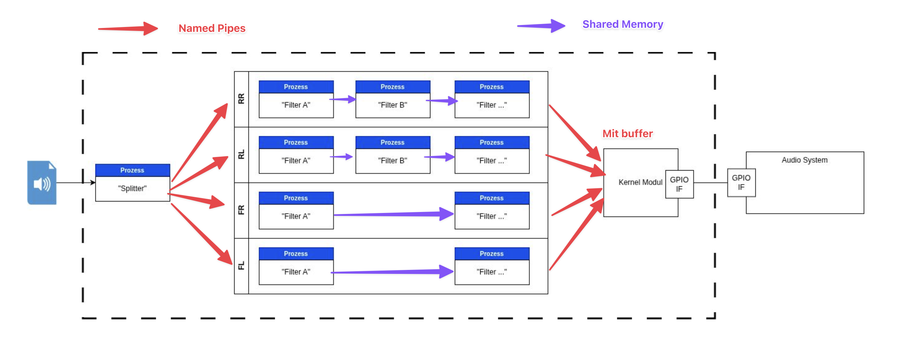

# Embedded Linux Projekt

## Festlegungen / Entscheidungen

1) Kommunikation zwischen den Prozessen

2) Modularität und Skalierbarkeit der Filter
    - 
3) Welches GPIO-Interface-Protokoll nutzen wir?
    - Time Division Multiplex (oder)
    - I2C (oder)
5) Dateiheader Template
    - Siehe Datei [Header](./HEADER.md)
